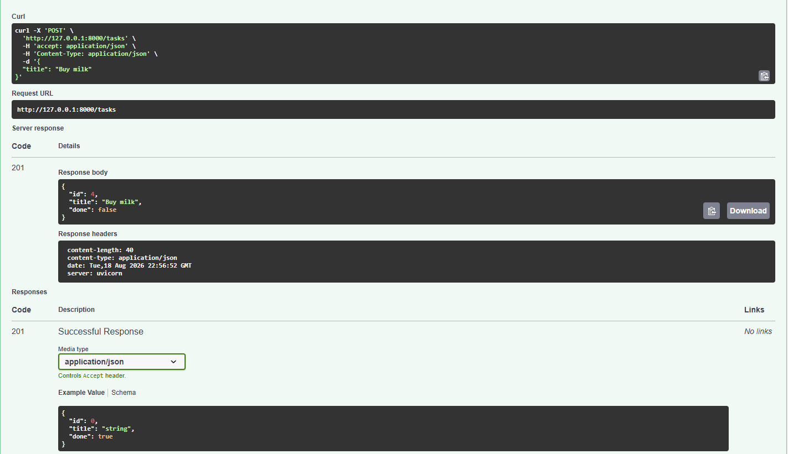
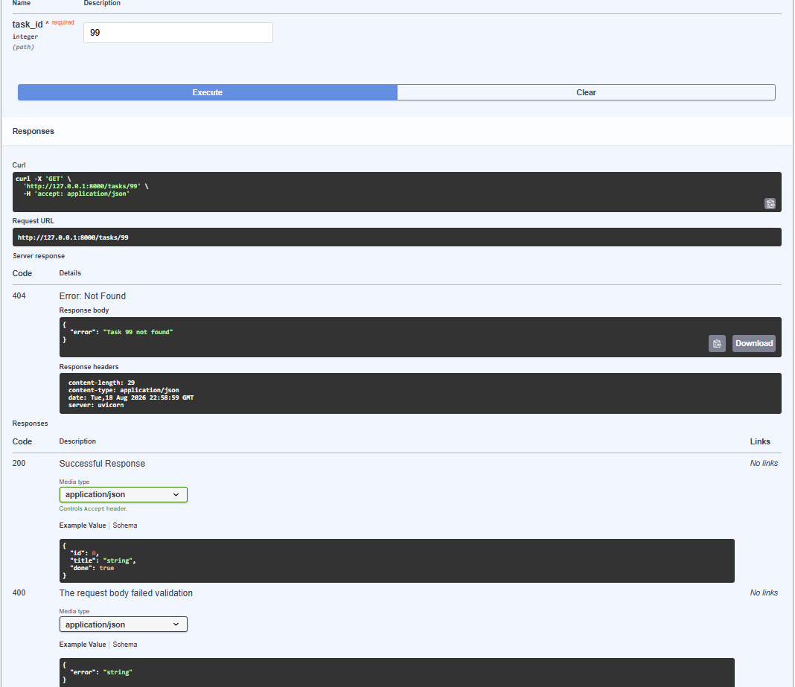

# Task API

A small REST API for tracking tasks, built with FastAPI. It started life in Week 2 as
a CRUD API over a plain Python list; in Week 3 that list was replaced with a real
SQLite database. The routes, request bodies, response shapes and status codes did not
change at all — only where the data lives did.

Everything still lives in one file, [`main.py`](main.py).

## How the table gets created

The `tasks` table is defined once, in [`db/schema.sql`](db/schema.sql), and applied by
**Postgres's `docker-entrypoint-initdb.d` mount** rather than by an init step inside the
app. The compose file mounts the file read-only into the container, and the official
`postgres` image runs everything in that directory the first time the data volume is
initialised.

That choice was the simpler of the two the brief offered. The app already had to stop
owning its schema when the repository interface came out of `main.py`, and the
entrypoint mount finishes that job: no DDL in Python, no "have I migrated yet?" check on
every startup, and the schema is a plain `.sql` file that `psql` can read.

The trade-off worth knowing: **the entrypoint only fires on an empty data volume.** Edit
`db/schema.sql` against a volume that already exists and nothing happens. Either recreate
the volume with `docker compose down -v` (which deletes the data), or apply the file by
hand:

```bash
docker compose exec -T db psql -U tasks -d tasks -f /docker-entrypoint-initdb.d/schema.sql
```

Both statements in the file are guarded — `CREATE TABLE IF NOT EXISTS`, and a seed that
only inserts `WHERE NOT EXISTS (SELECT 1 FROM tasks)` — so running it by hand is safe and
will not duplicate the example rows.

## Why SQLite

The Week 2 version kept tasks in a Python list, which meant every restart wiped them.
Fixing that means writing the data somewhere outside the process, and SQLite is the
smallest thing that does it properly:

- **It is a file, not a server.** `tasks.db` sits next to the code. There is nothing
  to install, nothing to start, no port, no user, no password. Compared with Postgres
  or MySQL, that removes the entire "get the database running" problem.
- **It ships with Python.** The `sqlite3` module is in the standard library, so the
  dependency list is still just `fastapi`. Nothing was added to make this work.
- **It is still real SQL.** Tables, `INSERT`, `UPDATE`, `DELETE`, `WHERE`, `COUNT()`,
  transactions — the same SQL a bigger database would want. Moving to Postgres later
  is a change of driver and connection string, not a change of mental model.
- **It can be opened by other tools.** The database file can be inspected and edited in
  DB Browser for SQLite while the API is running, which is what made stage 4
  convincing: change the file, and the API's answers change with it.

The trade-off is that SQLite handles one writer at a time and lives on one machine, so
it is not what you would reach for behind a busy multi-server app. For a single-process
task API it is exactly the right size.

## Where the data lives

`tasks.db`, in the repo root, right next to `main.py`. The path is resolved from
`__file__` rather than the working directory, so `uvicorn main:app` finds the same file
no matter which folder it is launched from.

The file is **not** committed — it is generated. On startup the app:

1. creates `tasks.db` if it does not exist,
2. runs `CREATE TABLE IF NOT EXISTS tasks (...)`,
3. inserts the three example tasks **only if the table is empty**.

So a fresh clone gets a working database with three tasks on its first run, and every
run after that leaves the existing data alone.

The table is deliberately small:

| Column | Type | Notes |
|---|---|---|
| `id` | `INTEGER PRIMARY KEY` | Not `AUTOINCREMENT`. A plain integer primary key aliases SQLite's `rowid`, which hands out `max(id) + 1` — the same id rule Week 2 used. |
| `title` | `TEXT NOT NULL` | Stored trimmed. |
| `done` | `BOOLEAN NOT NULL DEFAULT 0` | SQLite has no real boolean type, so this is stored as `0`/`1` and converted back to `true`/`false` on the way out. |

## Requirements

- Python 3.10 or newer (built and tested on 3.14)
- `fastapi` — still the only dependency; `sqlite3` comes with Python

## Install

```bash
git clone https://github.com/UbejdMo/connecting_to_db.git
cd connecting_to_db

python -m venv .venv
.venv\Scripts\activate          # Windows
# source .venv/bin/activate     # macOS / Linux

pip install "fastapi[standard]"
```

## Run

```bash
uvicorn main:app --reload
```

The API is then at <http://localhost:8000> and the interactive docs at
<http://localhost:8000/docs>. `tasks.db` appears in the project folder on that first
run — there is no migration step or setup command to remember.

## Endpoints

| Method | Path | Description | Success | Errors |
|---|---|---|---|---|
| `GET` | `/` | Service name, version, and where to go next | `200` | — |
| `GET` | `/health` | Liveness probe for monitors and load balancers | `200` | — |
| `GET` | `/tasks` | Every task, oldest first | `200` | — |
| `GET` | `/tasks/{id}` | One task by id | `200` | `400` non-integer id, `404` unknown id |
| `POST` | `/tasks` | Create a task from `{"title": "..."}` | `201` | `400` missing/empty/non-string title |
| `PUT` | `/tasks/{id}` | Update `title`, `done`, or both | `200` | `400` empty body or bad field, `404` unknown id |
| `DELETE` | `/tasks/{id}` | Remove a task; response body is empty | `204` | `404` unknown id |

### The task object

```json
{ "id": 1, "title": "Buy milk", "done": false }
```

### The error shape

Every failure — all of them, no exceptions — comes back as a single-key object:

```json
{ "error": "Task 99 not found" }
```

### Rules the server enforces

1. A new task's `id` comes from SQLite, which assigns the highest current `id` plus one.
2. A new task is always created with `done: false`. If the client sends `done: true` on
   create, it is ignored.
3. A `title` that is missing, empty, whitespace-only, or not a string is rejected with
   `400`, and nothing is written to the database.
4. `PUT` accepts `title`, `done`, or both. Whatever you leave out keeps its current
   value — only the columns the client actually sent appear in the `SET` clause. An
   empty body `{}` is a `400`.
5. `DELETE` returns `204` with a genuinely empty body — no `null`, no `content-length`.

## It works — real output

Captured from a live server:

```console
$ curl -X POST http://localhost:8000/tasks -H "Content-Type: application/json" -d '{"title":"End to end check"}'
{"id":4,"title":"End to end check","done":false}                 # 201

$ curl -X PUT http://localhost:8000/tasks/4 -H "Content-Type: application/json" -d '{"done":true}'
{"id":4,"title":"End to end check","done":true}                  # 200

$ curl http://localhost:8000/tasks
[{"id":1,"title":"Buy milk","done":false},{"id":2,"title":"Read a chapter of the FastAPI docs","done":true},{"id":3,"title":"Walk the dog","done":false},{"id":4,"title":"End to end check","done":true}]

$ curl -X DELETE http://localhost:8000/tasks/4                   # 204, empty body

$ curl http://localhost:8000/tasks/4
{"error":"Task 4 not found"}                                     # 404

$ curl -X POST http://localhost:8000/tasks -H "Content-Type: application/json" -d '{}'
{"error":"title is required and must be a non-empty string"}     # 400
```

### The persistence experiment

The Week 2 README ended with the opposite experiment: create a task, restart, watch it
vanish. Same steps, new storage:

```console
$ curl -X POST http://localhost:8000/tasks -H "Content-Type: application/json" -d '{"title":"Survive a restart"}'
{"id":4,"title":"Survive a restart","done":false}

# stop the server, then start it again with: uvicorn main:app

$ curl http://localhost:8000/tasks
[{"id":1,"title":"Buy milk","done":false},{"id":2,"title":"Read a chapter of the FastAPI docs","done":true},{"id":3,"title":"Walk the dog","done":false},{"id":4,"title":"Survive a restart","done":false}]
```

Task 4 is still there, and the example tasks were not inserted a second time.

## Looking at the database directly

`tasks.db` can be opened in [DB Browser for SQLite](https://sqlitebrowser.org/) while
the server is running. One of the queries run against it in stage 4:

```sql
SELECT * FROM tasks WHERE done = 1;
```

Calling `GET /tasks` straight after an `UPDATE tasks SET done = 1;` in the viewer showed
all three tasks as `"done": true` without restarting the server — the API reads the file
on every request, so it sees edits made by anything else. The full session, including
what `UPDATE` and `DELETE` without a `WHERE` clause do, is written up in
[`docs/sql-exploration.md`](docs/sql-exploration.md).

### Database viewer screenshot

`tasks.db` open in DB Browser for SQLite, running `SELECT * FROM tasks;` against the
three seeded rows. `done` shows as `0` and `1` here — that is the real storage, and
converting it back to `true`/`false` is exactly what `row_to_task` exists to do.


Screenshots of the other two queries, and the full write-up, are in
[`docs/sql-exploration.md`](docs/sql-exploration.md).

## Interactive docs

FastAPI generates an OpenAPI document at `/openapi.json` and serves Swagger UI at
`/docs`, where every endpoint can be run from the browser.





## Notes / what I learned

**The API surface did not have to change.** Swapping the storage layer touched the
inside of six functions and nothing else — no route, no status code, no response body.
That is the whole argument for keeping storage behind a small set of helpers rather than
letting route handlers reach into a list directly.

**`?` placeholders, not f-strings.** Every value that comes from a client goes into the
SQL as a `?` parameter. The one place a name *is* interpolated — building
`SET title = ?, done = ?` in `PUT` — only ever interpolates the literal strings `"title"`
and `"done"`, chosen by my code, never by the request. Client values never reach the SQL
text itself.

**Seeding needs a guard, and the guard has a consequence.** `CREATE TABLE IF NOT EXISTS`
plus "insert only when `COUNT(*)` is 0" is what stops three new example tasks appearing
on every restart. The consequence is that deleting *every* task and restarting brings the
examples back — the table is empty again, so by that rule it gets seeded again. As long
as one row survives, the seed never fires.

**`rowcount` replaces the "does it exist?" lookup.** `DELETE` used to search the list,
fail to find anything, and raise a 404. In SQL, `DELETE ... WHERE id = ?` followed by a
check on `cursor.rowcount == 0` does the search and the delete in one statement.

**`INTEGER PRIMARY KEY` is not the same as `AUTOINCREMENT`.** The plain version aliases
`rowid` and reuses the highest freed id, which is exactly what `max(id) + 1` did in
Week 2. `AUTOINCREMENT` would never reuse an id — a different, arguably safer rule, but a
change in behaviour, so the version that matches Week 2 was the right one here.

**Booleans are a fiction in SQLite.** `done` is stored as `0` or `1`. One `row_to_task`
helper casts it back to a real `True`/`False`, so the JSON contract stays honest and no
route has to remember to do it.
